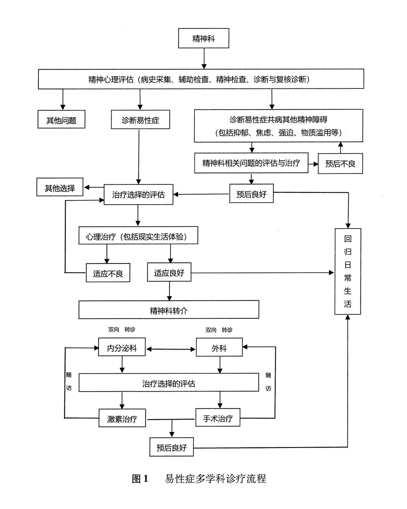

# 中国易性症多学科诊疗专家共识

<!-- markdownlint-disable no-inline-html -->

中国心理卫生协会性心理健康专业委员会

陆峥，刘娜，陈发展，丛中，刘阳，陶林，邸晓兰，刘华清，过斌，禹海航，赵烨德，潘柏林，刘烨，李革临，杨卫敏，张青，黎莉，马晓年

**摘要**：临床实践中，易性症的评估、诊断和治疗在国内尚未形成共识，这影响了患者的治疗需求和专业者的诊疗规范。专家共识需要多学科的合作，鉴于此，中国心理卫生协会性心理健康专业委员会组织精神科、内分泌科、外科和伦理学等专家，立足于临床实践需求，遵循循证医学，参考国内外相关指南，结合国家相关规定，制定了国内首部易性症诊疗专家共识，以期为相关学科专业人员提供更安全有效的诊疗规范。

**关键词**：易性症；诊断；治疗；多学科；专家共识

**中图分类号**：R749

**文献标识码**：A

**文章编号**：1005-3220(2022)S0-0001-15

通信作者：

- 陆峥，Email: <luzheng@tongji.edu.cn>
- 刘娜，Email: <li-unamsx@126.com>
- 陈发展，Email: <develop909@163.com>

基金项目：

- 上海市临床重点专科建设项目（2018）
- 上海市浦东新区医学临床高原学科建设项目（PWYgy2021-02）
- 上海市浦东新区卫生系统学科带头人培养计划（PWRd2019-08）

作者单位：

- 同济大学附属同济医院（陆峥，刘娜）
- 上海交通大学医学院附属精神卫生中心（陆峥，刘娜，杨卫敏，张青，黎莉）
- 同济大学附属精神卫生中心，上海市浦东新区精神卫生中心，同济大学精神疾病临床研究中心（陈发展）
- 北京大学第六医院（丛中）
- 上海交通大学医学院附属第九人民医院（刘阳）
- 深圳市卫生健康发展研究和数据管理中心（陶林）
- 北京回龙观医院，北京大学回龙观临床医学院（邸晓兰，刘华清，过斌）
- 宁波市康宁医院（禹海航）
- 长海医院虹口分院（赵烨德）
- 北京大学第三医院（潘柏林，刘烨）
- 首都医科大学附属北京友谊医院（李革临）
- 清华大学玉泉医院（马晓年）

作者专业学科：

- 精神科：陆峥，刘娜，陈发展，丛中，邸晓兰，刘华清，过斌，禹海航，杨卫敏，张青，黎莉
- 整形外科：刘阳，赵烨德，潘柏林
- 内分泌科：刘烨
- 耳鼻喉科：李革临
- 性医学科：马晓年
- 其他：陶林

DOI: [10.3969/j.issn.1005-3220.2022.z1.001](https://doi.org/10.3969/j.issn.1005-3220.2022.z1.001)

---

Chinese expert consensus on multi-disciplinary diagnosis and treatment of transsexualism

Professional Committee on Psychosexual Health of Chinese Association for Mental Health.

LU Zheng, LIU Na, CHEN Fa-zhan, CONG Zhong, LIU Yang, TAO Lin, DI Xiao-lan, LIU Hua-qing, GUO Bin, YU Hai-hang, ZHAO Ye-de, PAN Bo-lin, LIU Ye, LI Ge-lin, YANG Wei-min, ZHANG Qing, LI Li, MA Xiao-nian.

Shanghai Tongji Hospital of Tongji University, Shanghai 200065, China;
Shanghai Mental Health Center, Shanghai Jiao Tong University School of Medicine, Shanghai 200030, China

**Abstract**: In clinical practice, there was no consensus on the evaluation, diagnosis and treatment of transsexualism in China, which affected the treatment needs of patients, and the standardized diagnosis and treatment for professionals. Generally speaking, the expert consensus requires multi-disciplinary cooperation. In view of this, the Sexual Mental Health Professional Committee of Chinese Mental Health Association organized experts in psychiatry, endocrinology, surgery and ethics to develop the first expert consensus on the diagnosis and treatment of transsexualism in China based on the needs of clinical practice, following evidence-based medicine, referring to relevant domestic and foreign guidelines, and combining relevant national regulations, in order to provide more safe and effective diagnosis and treatment norms for professionals in relevant disciplines.

**Keywords**: transsexualism；diagnosis；treatment；multi-disciplinary；expert consensus

---

易性症（transsexualism）是以显著而持久的内在性别身份体验与出生生理性别不一致为特征的一类疾病，患者渴望通过激素或外科手术等治疗方式使身体尽可能地与所偏爱的性别身份相一致。
易性症（男转女）是指出生生理性别为男性，但其内在性别身份体验为女性；

易性症（女转男）则相反。
也有部分患者只表出内在性别身份体验与生理性别不一致的显著烦恼，并不对异性身份渴望，呈现泛性别化或无性别化。
顺性别者是指内在性别身份体验与出生生理性别相一致者。

易性症（男转女）患病率为 0.005% ～ 0.014%，比易性症（女转男）患病率（0.002% ～ 0.003%）略高。

在儿童中，这一比例约从 2:1 到 4.5:1；

在青少年中，比例几乎相等；

在成年人中，这个比例从 1:1 到 6.1:1 [^1]。

目前认为其发病机制与生物社会心理因素有关。

患者常合并其他精神障碍，存在病耻感，自杀率高于一般人群 [^2]。

易性症的诊疗涉及精神科、内分泌科、整形外科、泌尿科、五官科、妇产科或生殖医学科等多个学科，对不同学科间合作程度的要求较高，需要完整而规范的诊治流程。

有鉴于此，中国心理卫生协会性心理健康专业委员会组织国内在易性症诊治方面临床经验丰富的多学科专家，结合我国国情，参考国外指南，共同制定了我国首部易性症诊疗专家共识，以期提高临床医生对易性症的认识，加强多学科间的相互合作，规范诊疗流程，为更科学、安全、有效的诊疗提供依据和参考。

## 1 易性症的病因

易性症是由基因决定的还是由环境决定的，目前国内外尚无定论。

遗传可能性测量范围在 0 ～ 1 之间。

对 1891 对双胞胎易性症研究显示，遗传模式易性症（男转女）为 0.50 ～ 0.57，而易性症（女转男）为 0.30 ～ 0.37 [^3]。

对 KANSL1、CYP19、雄激素受体（AR）、雌激素受体（ER）、黄体酮受体（PR）相关基因研究较多，但仍未得出明确结论 [^4]。

两性脑部解剖结构不同，激素水平也存在差异。

类固醇激素作用于胎儿期脑部雌激素和雄激素受体，通过级联反应，使两性脑部不同区域体积、神经细胞的数量以及神经递质等出现差异。

性别认同与出生性别相反的个体，脑结构可能更近似于其所感知的性别群体。

核磁共振成像研究显示，成年易性症（男转女）患者相对于顺性别男性，左侧躯体感觉皮层的灰质体积、左侧角回和顶下小叶的灰质体积可能更小，右侧壳核的灰质体积、右侧大脑半球的颞顶联合区和下额皮质和岛叶皮质的灰质体积可能更大。

青少年易性症（男转女）患者与顺性别男性相比，小脑（双侧）与下丘脑的容量可能更小。

弥散张量（DTI）的数值可反映白质微结构，包括部分各向异性指数（FA）、平均弥散系数、轴弥散系数和放射状弥散系数。

成年易性症（男转女）患者的 FA 值在双侧额枕束、双侧上下纵束和右侧额枕束低于顺性别男性，但与顺性别女性无显著差异，提示可能存在性别特征的 FA 值 [^5] [^6]。

易性症的发生和发展还可能受到童年早期的性别分化、青少年期的第二性征出现和社会环境改变的影响。

易性症患者童年早期的性别角色学习行为可能落后于正常儿童。

青春期和青春期后的性别认同可能受第二性征发育、对性活动的探索、朋友和社交媒体的影响。

童年早期的性别不认同延续至成人期的比例在 10% ～ 39%之间，可能中断的关键期是 10 ～ 13 岁。

在此期间，患者第二性征出现，体内激素水平急速升高，男性或女性特质更加明显，尤其当有了性冲动和经验后，能体会到作为当前性别所带来的快感；

另外，随着性别角色的不断社会化，从当前性别中不断获益，可能促使患者对性别身份进一步认可和接纳。

性别不认同持续的可能影响因素包括性别不认同对患者造成困扰的严重程度、认同的持久性和确定性、童年期的性别认同情况以及自身对性别倾向性的强烈程度 [^4] [^7] [^8]。

## 2 易性症的诊断

### 2.1 诊断要点

目前，易性症的诊断依然依据《国际疾病分类》第 10 版（ICD-10） [^9]进行，诊断要点包括“转换性别身份的强烈渴望至少持续 2 年，且不应是其他严重精神障碍如精神分裂症的继发症状，也不伴有遗传或性染色体异常等情况。

“在即将投入使用的 ICD-11 中 [^10]，易性症被性别不一致（Gender Incongruence，GI）取代，诊断要点包括“强烈而持续的内在性别体验与出生生理性别不一致，为了能够以体验性别生活或被接纳，常常渴望通过激素、手术或其他医学治疗使身体与体验性别一致。”

青春期和成人 GI 的诊断没有了明确的病程标准，取而代之的是较为模糊的“持续存在”的描述。

但是儿童 GI 的诊断依然要求至少持续 2 年。

在美国《精神障碍诊断与统计手册》第 5 版（DSM-5）[^1]中，使用性别烦躁（Gender Dysphoria，GD）描述易性症，要求典型症状持续而显著地存在 6 个月以上即可诊断。

需要注意的是，单独出现的性别异化表现，例如男性女性化举止、打扮，或者女性男性化举止、打扮，如果无强烈而持续的性别转换渴望则不能诊断。

### 2.2 临床特征

易性症是出生生理性别与体验（或表现出来）的性别不一致。

这种不一致，在不同年龄群体中的表现不同。

如易性症（女转男）在青春期前可能会表达想成为男孩的愿望，声称自己是男孩，或将成长为男人；

偏爱男孩的衣物和发型，会要求他人用男孩的名字称呼自己；

对于父母要求其穿裙子或其他女性服饰表现出强烈的反对；

喜欢传统的男孩活动或游戏，对女孩玩具或活动毫无兴趣。

易性症（男转女）的临床表现则相反。

在青春期第二性征出现时，易性症（男转女）患者会刮去体毛，固定阴茎使勃起不易被看见等；

易性症（女转男）患者会束胸，弯腰驼背走路，或穿着宽松的运动衫，使乳房不易被看见等。

许多青少年易性症患者往往对性激素和性别重置手术有强烈的渴望。

这些患者在进入高中时就已经开始以他/她们渴望的性别角色生活。

成年患者一般实施所体验到的性别行为，如穿戴异性的服饰，表现异性的言行举止等。

往往不愿以出生性别示人，强烈希望能成为异性。

在对性别困惑之际，青春期和成年易性症患者的自伤/自杀观念、企图和行为的风险较高。

而之后的适应过程中仍然存在这种自伤或自杀风险。

### 2.3 诊断分型

1. 易性症（男转女）亚型：

   患者出生生理性别是男性，但是内在性别身份体验是女性，渴望通过激素或者手术等治疗方法改变生理结构，尽可能让身体与所偏爱的性别体验相一致。

   患者通常从儿童时期开始就一直具有相当的女性特质，在青春期性发育后性别烦躁增加，可寻求激素治疗或性别重置手术，很少会在后期才寻求帮助。

1. 易性症（女转男）亚型：

   患者出生生理性别是女性，但是内在性别身份体验是男性，渴望通过激素或者手术等治疗方法改变生理结构，尽可能让身体与所偏爱的性别体验相一致。

   患者通常自童年起就一直表现出男性化的行为和态度，渴望成为拥有男子气的成人。

   患者青春期女性性征发育后性别烦躁增加，对激素治疗或者手术治疗的渴求增加。

1. 突发型 [^4]：

   患者在儿童期并无性别体验和生理性别不一致的症状，但在青春期后，突然出现易性症的临床特征。

   有研究显示，该亚型人群以出生性别女性为主，占 82.8%，平均年龄为 16.4 岁，常喜交往易性症朋友或沉迷于社交媒体，共病精神障碍或精神发育迟滞的比例较高，发病前往往有严重的社会心理应激。

1. 未特定型 [^1] [^9] [^10]：

   这类患者具有易性症的典型症状，但是未能符合易性症的全部诊断标准，例如典型症状持续时间不足，排除其他精神障碍因素或者性染色体异常的信息尚不充分等。

以上各亚型患者因其性取向的不同又被分作同性性取向、异性性取向、双性性取向、泛性性取向、无性取向及不确定性取向等。

这里的性取向基于生理性别来划分，例如，同性性取向易性症（男转女）患者的性爱对象为男性，异性性取向易性症（男转女）患者的性爱对象为女性。

一般而言，同性性取向的易性症患者的症状更加典型、持续时间更久，在青春期后即具有强烈的性别转换需求。

也有部分患者为异性性取向，即使转变成其他性别后，依然爱慕的是异性（基于与自己生理性别而言的异性）。

或者，对同性和异性均爱慕的双性性取向，性爱对象的性别不作为特征的泛性性取向，不爱慕他人的无性性取向或不确定爱慕何种性别的不确定型性取向。

### 2.4 不同诊断系统间的比较

ICD-10 的分类名称为“性身份障碍”，在“精神、行为或神经发育障碍”章节之下，包括易性症、双重异装症、童年性身份障碍、其他性身份障碍和性身份障碍（未特定）。

易性症的年龄范围包括青少年和成人，但不包括儿童。

DSM-S 的诊断名称是“性别烦躁”，与 DSM-IV 中的“性与性身份障碍”相比，“性别烦躁”更具有描述性，并且聚焦于“烦躁”这一临床问题而非“认同”本身。

性别烦躁分为儿童性别烦躁、青少年和成人的性别烦躁、其他特定的性别烦躁、未特定的性别烦躁。

即将在临床使用的 ICD-11，其相关分类名称由“性身份障碍”改为“性别不一致”，分为童年期性别不一致、青春期或成年期性别不一致、性别不一致（未特定）。

相对于 DSM-5 的诊断标准，自觉痛苦和功能损害已并非必需，因此对出生生理性别不认同的人群，即使没有显著的痛苦体验或明显的功能损害（学习、工作、社会化等）也能够符合诊断标准并获得治疗。

由于新的诊断标准的宽泛，诊断可能被用于更多样化的人群。

随着标准的实施，病耻感也会随之出现。

因此 ICD-11 将其从第六章“精神、行为或神经发育障碍”中移出，放入第十七章“与性健康相关问题”章节，即不再将其归属于精神障碍的范畴 [^11]。

## 3 精神心理评估

### 3.1 病史采集

1. 性心理发展史：

   要详细了解患者的自我性身份意识的发展经历，包括：

   - 目前性别不认同的状况、性幻想；
   - 异装史、手淫和性游戏史；
   - 性取向、性行为和性传播疾病感染史；
   - 病耻感，遭遇的各种歧视或遭受暴力攻击 [^12] [^13] [^14] [^15] 等。

1. 其他重要信息：

   包括精神障碍史、家族史、自杀史、物质滥用史和治疗史等。

### 3.2 辅助检查

#### 3.2.1 筛查评估问卷

目前缺乏国际公认的筛查问卷，但较为常用的有

1. 性别认同/性别烦躁问卷（有青少年版和成人版）（GIDYQ-AA） [^16]：

   包含 27 项条目，1（总是）～ 5 分（从不）评分，分数越低，患易性症的可能性就越大。

1. Utrecht 性别烦躁量表（UGDS） [^16]：

   以自我报告的方式评估青少年的性别角色和性别认同，有女转男和男转女两个版本。

   包含 12 项条目，评分 1 ～ 5 分（含反向评分），分数越高，则易性症的可能性就越大。

#### 3.2.2 量表评定

量表评定具有标准化、细致化、客观化和数量化的特点。

标准化的评估，有助于建立正确的诊断和制定合适的治疗计划；

全面系统而细致的评估，有助于鉴别诊断、识别共病和预测结局；

客观的评价标准，有助于更直观地反映疾病变化，提高诊治效率。

因此，精神科常用心理评估量表可广泛应用于易性症的诊断与评估。

1. 一般心理健康量表：

   用以评定心理健康状况，包括

   - 90 项症状清单（SCL-90）
   - 一般健康问卷（GHQ）

   等

1. 人格测验：

   - 明尼苏达多相人格测验（MMPI）
   - 艾森克人格问卷（EPQ）

1. 抑郁量表：

   - 汉密尔顿抑郁量表（HAMD）
   - 抑郁自评量表（SDS）
   - Montgomery-Asberg 抑郁量表（MADRS）
   - 9 项患者健康问卷（PHQ-9）

1. 焦虑量表：

   - 汉密尔顿焦虑量表（HAMA）
   - 焦虑自评量表（SAS）
   - 7 项广泛性焦虑障碍量表（GAD-7）

1. 恐惧/强迫量表：

   - Yale-Brown 强迫量表（Y-BOCS）
   - Marks 恐惧强迫量表（MSCPOR）
   - Liebowitz 社交焦虑量表（LSAS）

1. 躁狂量表：

   - Young 躁狂评定量表（YMRS）
   - 轻躁狂检测清单（HCL-32）
   - 心境障碍问卷（MDQ）

1. 社会支持量表：

   - 社会支持评定量表（SSRS）
   - 领悟社会支持量表（PSSS）

1. 其他：

   - 生活事件量表（LES）
   - 进食问题调查量表（EDI）
   - 家庭疾病负担量表（FBS）
   - 自杀意向量表（SIS）
   - 自杀潜质指数（IPS）

   等

#### 3.2.3 其他检查

包括

- 外阴检查
- 染色体组型分析
- 内分泌检测
- B 超
- 电子计算机断层扫描（CT）
- 尿生殖窦造影
- 病理学检测

等，排除

- 真假两性畸形
- 先天性肾上腺皮质增生症（CAH）

等。

### 3.3 精神检查

包括一般情况、感知觉、思维、情感、智能、自知力、意志行为等，特别需要关注出生生理性别与体验性别不一致伴随的焦虑抑郁情绪、社会家庭压力和自杀倾向，以及是否存在精神病性障碍及家族遗传情况。

### 3.4 诊断与复核诊断

由一位副主任或副主任以上精神科医师做出初步诊断后，另一位副主任或副主任以上精神科医师完成复核诊断后，易性症的诊断方能成立。

易性症的诊断和复合诊断的精神科医师须接受过易性症诊疗的相关专业培训。

易性症患者绝大多数不共病严重精神疾病，但常被误诊为妄想综合征，对于青少年尤其如此。

一般来说，跨性别的先占观念通常会妨碍其日常活动，如在学校或工作场所的功能受损。

外界的偏见、歧视和排斥等会导致其负性的自我评价，增加精神障碍共病的风险。

青少年患者常共病焦虑障碍、抑郁障碍和对立违抗障碍。

成人患者最常共病抑郁障碍和焦虑障碍，其他还包括双相障碍、强迫性障碍、物质使用障碍、人格障碍、进食障碍等，部分患者存在自我伤害甚至自杀行为等。

必须强调的是，共病诊断要求易性症是主要诊断之一，且不能被其他诊断所替代。

作为共病的其他诊断，必须符合相应的诊断标准，要求易性症与共病的症状同时存在，且同样突出。

如不能达到诊断标准，则不能诊断共病。

需要与以下疾病进行鉴别：

1. 双重异装症：

   个体生活中某一时刻穿着异性服装，以暂时享受作为异性成员的体验，但并无永久改变性别的愿望。

   在穿着异性服装时并不伴有性兴奋。

2. 恋物性异装症：

   异装行为伴有性唤起，一旦达到性高潮，性兴奋开始消退时，便强烈希望脱去异性服装。

   在易性症患者中，早期阶段也有恋物性异装症的过程，可能是易性症的一个发展阶段。

3. 精神分裂症与其他精神病性障碍：

   在精神分裂症中有少部分患者存在性别改变妄想，即坚信已自行改变为异性性别。

   易性症患者虽渴望改变性别，但能够认识到自身性别并了解性别重建是长期的过程。

   抗精神病药物往往对性别改变妄想有效，但对易性症患者无明显疗效。

## 4 开具精神科诊断证明

诊断证明须由三级医院精神科或心理科出具并满足以下要求:

1. 根据 ICD-10 诊断标准，明确诊断易性症；
1. 排除性发育异常，并提供相应的检查依据；
1. 需详细了解病史，18 岁以下者至少有一位家长伴诊；
1. 首次就诊后建立门诊大病历，至少随访 1 年，就诊次数不少于 4 次，间隔时间不短于 1 个月；
1. 共病的其他精神障碍临床缓解 6 个月以上，并在病史中详细记录；
1. 如存在诊断疑难，需经至少 3 位副主任或副主任医师以上精神科专家会诊。

## 5 治疗选择的评估

精神科医师有一项很重要的任务，就是让患者了解性别选择和表达的多样性，以便减轻患者的心理负担。

帮助患者去探索和发现最适合自己的性别角色和性别表现，如果需要可充分告知可利用的医学治疗手段。

从个人、家庭、社会三个方面考虑维持现有性别和改变性别的利弊点，让患者与家人充分沟通后达成共识并做出决定（表 1）。

治疗选择的过程还包括心理治疗以及社区和同伴支持等过程中的协商、体验和确认。

精神科医师须告知性别的改变和医学干预对患者造成的短期或长期作用，包括心理、社会、躯体、性、职业、财务、伦理和法律等。

（表 1）性别改变利弊分析表

请您从个人、家庭、社会三个维度列出性别维持和转变的“有利”和“不利”之处，并与家人充分沟通和讨论，并达成共识。

内容不仅限于 3 条，可附加页。

<!-- prettier-ignore -->
| 性别 | 有利点 | 不利点 |
| - | - | - |
| 维持 | 个人： 家庭： 社会： | 个人： 家庭： 社会: |
| 改变 | 个人： 家庭： 社会： | 个人： 家庭： 社会: |

青少年易性症患者的治疗选择评估尤其要谨慎，一方面处于生理心理发展期的青少年在心理和认知方面尚未成熟；

另一方面青春期抑制治疗或激素治疗的长期影响尚不清楚，可能造成治疗结局的不确定性。

根据荷兰模式推荐的评估内容，特别强调青少年易性症患者的治疗需要全面考虑和评估病史，包括社会心理问题、家庭及其他社会支持系统、在青春期表现出的易性症相关症状等 [^18]。

## 6 知情同意

知情同意是医务人员必须遵守的一项重要伦理原则和法律准则，以确保患者了解自己的病情、预后、具体的治疗方案、该治疗的受益和风险，以及替代治疗方案及其相对应的受益和风险，并确定患者在理解这些信息后是否同意治疗。

尽管法律规定 18 岁以上患者才具有知情同意的权利，但当治疗涉及青少年时，需要考虑特殊的情况。

应告知适合其年龄段的治疗信息、推荐的疗法及替代治疗的方案，并征得他们和监护人的知情同意。

对于青少年自主决定的能力评估，主要了解如下 5 个方面:

1. 能够理解所提出的治疗方案；
1. 能够理解治疗的预期结果，如期望的结果和可能的不良反应；
1. 能够理解与所提出治疗方案不同的治疗选择；
1. 有能力合理地预见到不同选择的结果及权衡风险和治疗获益；
1. 能做出与自己核心诉求相一致的治疗选择的决定，如与预期的健康目标、确认性别和生活目标相一致的治疗方案 [^19]。

## 7 隐私保护

隐私保护是需要重点关注的问题。

因此，医生除了对就诊者的信息严格保密外，对患者的父母或亲属也应说明对出生性别保密的重要性，以避免对患者产生不必要的伤害。

## 8 医患关系

营造包容接受的社会生态，有助于易性症患者得到社会尊重，减少社会歧视和避免诊疗过程中的冲突 [^20]。

医生尊重患者自主做出选择，构建良好的医患关系。

当医生的道德立场与患者的选择产生明显冲突时，医生可以选择退出这一治疗关系，而不是过度卷入其中。

但医生不应当拒绝去理解易性症患者所面临的社会生活困境，包括寻求治疗、忍受社会歧视和承受着各种压力。

转介给更合适治疗的医生，不意味着“放弃病人”，而是一种基于患者利益最大化考量的义务。

## 9 精神科相关问题的治疗

易性症的各种原发症状并不需要精神科的特别治疗，但共病的精神障碍，应进行规范化的治疗，包括药物、物理和心理治疗等。

伴随的精神症状可根据评估结果和患者的意愿，选择合适的治疗。

在治疗过程中，应注意共病精神障碍的周期性或进行性加重，可能会延缓或阻碍易性症患者的性激素或性别重置手术的治疗进程；

需要考虑性激素和抗精神病药物的相互作用，性激素治疗也可能影响患者的情绪状态；

抗精神病药物的不良反应也可能影响性激素和外科治疗。

在治疗过程中，应注意风险和获益，风险不应大于潜在的治疗获益。

## 10 心理治疗

易性症的心理治疗目标是促使患者的整体心理健康、生活质量和自我实现的最大限度提升 [^21]。

精神科医生、心理治疗师或心理咨询师在对易性症患者进行心理治疗或咨询时需要掌握以下基本知识和原则 [^22] [^23]:

1. 从事易性症心理治疗的专业者必须接受过专业的培训并获得相应资质，具备胜任力。

1. 讨论性别议题时，患者可能会出现紧张、不舒服、不安的情绪。

   治疗师应当为患者创造接纳的支持性环境，提供情绪支持，不过分介入。

1. 在治疗过程中，不要过度强调性别相关的困扰，可能会创造一个局限的视角，导致所有生活问题都指向性别议题。

   治疗师应该保持一个平衡：当前困扰可能与性别有关，也可能与性别无关。

1. 不把改变患者的性别认同作为主要目标，协助患者去探索性别困扰，减缓性别不安。

   不应将二元的性别观念强加于个体，应给予患者足够的空间去探索不同的性别呈现并做出自主选择。

   性别认同的探索包括自我感受、群体归属、身体性器官感受、期待他人如何看待自己 4 个维度。

1. 帮助患者区分性别认同和性取向的概念，并加以澄清。

   性别认同是个体内在对自我性别的感知，而性取向是个体对他人的性欲望和情感的吸引。

   性别认同意识往往早于性取向。

1. 具备足够的多元文化敏感性，

   理解患者的性别认同呈现与所处社会文化背景的关系，包括但不限于：年龄、民族或种族、教育背景、婚姻或情感状态、经济情况、移民情况、性取向、宗教信仰、残疾情况等。

   更为重要的是，易性症心理工作者要评估自身的多元文化胜任力：

   在临床工作中，应当觉察自身关于性别和性、性别刻板印象和易性症身份的个人信念，辨识自身的知识、理解和接纳方面的差距；

   探索自己的性别认同，以及自己与特权、权力或边缘化相关的性别经历。

   在实际工作中，心理工作者可以帮助患者理解和整合不同的身份。

1. 鼓励治疗师采用肯定性心理治疗，目标不是“改变”和“扭转”，而是支持和肯定；

   在去污名的基础上，帮助与鼓励患者自我接纳，接受自己的性取向、性别认同与性别表达。

   在肯定性心理治疗中可以和患者谈论他/她们的性别成长史、身体感受、性别意识，通过开放性的探索，患者在治疗师的支持下，获取对性别的洞察力，学习新的应对技巧，管理人际关系等。

   肯定性心理治疗包括以下原则：

   1. 使用性别肯定性语言，创造性别肯定的环境，例如性别中立的卫生间、更衣间等；

   1. 避免性别刻板印象；

   1. 肯定患者的性别认同与性别表达；

   1. 使用专业的名词或者患者认可的名词来称呼患者，包括：注意他和她的使用，主动询问患者的称呼等。

      使用专业名词，可以让患者知道治疗师有能力了解自己，不会遭遇到不理解和歧视；

   1. 避免根据外表假设患者的性别认同，并非所有患者都会认定自己是男性或女性，要为非二元性别身份提供空间；

   1. 在询问患者出生性别及相关的身体感受时需要谨慎，是出自治疗师的好奇还是治疗的需要，询问不当可能会引发患者对身体的厌恶情绪；

   1. 尊重患者的自我决定，治疗师的工作并不是帮助患者贴上一个“正确的”性别标签，不去用暗示的态度表达哪一种性别是好的，为患者探索性别认同提供一个安全、开放、包容的空间。

1. 识别和评估患者可能存在的病耻感、偏见、歧视和暴力，帮助其确定接纳自己的性别认同，提升应对社会歧视的能力。

1. 针对儿童和青少年患者时，需要注意不同年龄阶段的发展性心理需求，并非所有的“性别困扰”都会持续到成年阶段。

   部分患者改变性别的诉求有时可能是成长阶段的正常现象的特殊表达方式，也可能是对社会或家庭强加给予性别角色充满不满与抵触，甚至还可能是创伤遗留的表现。

1. 对老年患者要特别评估其躯体情况、医疗保险和家庭社会支持网络，鼓励拓展适应性的社交。

   对不愿公开性别认同的老年患者，要理解其害羞、恐惧、自责和孤独，选择适合的生活和医疗状态。

   对于接受激素和性别重置手术治疗的老年患者，要特别评估这些治疗与老年期疾病的关系。

1. 关注和理解患者的情感和性关系状态的变化过程，包括如何及何时与伴侣或者潜在的伴侣“出柜”，进行激素或手术治疗后的性欲望和性活动的变化，以及性安全等议题。

1. 需要了解和评估患者的家庭环境、成长经历和养育模式，以及家庭的支持状态。

   鼓励家庭成员参与到处理和应对家庭成员，尤其是儿童和青少年的性别不安的心理治疗中。

1. 与内分泌科、外科、社会工作者等进行跨学科协作，心理治疗应贯穿易性症治疗的全程。

   与社会工作者协作，协助患者和家属，在与社区和政府机构，例如教师、学校和法院互动时，扮演教育和倡导者的角色。

其中，家庭支持是我国易性症患者获得充分医学治疗的重要因素 [^24]。

易性症患者的家庭也会遭到社会歧视、偏见和病耻感 [^25]，家长对易性症知识的缺乏可能会让他们以善意姿态来阻止子女接受医学干预，从而导致伤害性延迟（a harmful delay） [^26]。

因此，对易性症患者，尤其是对青少年和年轻患者开展家庭治疗是必要的。

治疗的基础是对家庭开展心理健康教育，解释疾病的临床表现、疾病特征、病因和病理机制以及规范的治疗原则。

帮助家庭接纳现实，鼓励父母与未成年子女开展友好支持性的沟通，创造更安全的成长环境，有效提高个体的心理弹性，降低未来出现药物成瘾、自伤与自杀以及其他精神问题的风险 [^27]。

和患者的自我认同过程一样，家庭也会经历类似的历程。

易性症患者的家属一般会经历否认、愤怒、协商、悲伤、最终接受的过程，治疗师可以帮助家人理解他们目前处在哪个阶段。

在临床工作中，通常建议父母单独进行咨询或者团体咨询，去处理这些反应、需求、恐惧和其他情绪。

易性症患者家庭治疗的基本步骤如下 [^28]:

1. 评估家庭围绕性别困扰议题的恶性循环：

   家庭中最常见的恶性循环是家庭成员拒绝接纳或纠正其他成员的性别表达（通常是父母对子女），患者感到更加痛苦，症状加重后父母越发关注或者拒绝子女的性表达，并将痛苦归因于患者的性别表达；

1. 发现家庭的资源和例外情况：

   与家庭一起探索和寻找与“恶性循环”互动不同的模式，例如理解、支持、相互包容的互动时刻，以及家庭对性别议题不那么困扰的时刻；

1. 促发可以解决问题的家庭系统改变：

   基于对问题与家庭关系的新理解，激活家庭沉默的关系资源，探索如何建立有利于解决性别困扰议题的家庭互动，并对这些家庭互动进行检验、强化；

1. 家庭对性别困扰的接纳：

   建立接纳性别困扰的家庭认知和互动，支持和尊重患者决定采用的解决性别困扰的方式。

   需要注意的是，对于儿童患者，避免强化家庭过分认同易性化的表达，这可能弱化孩子自由表达的能力；

1. 未来的议题：

   与家庭探索性别困扰议题可能的干预方案和步骤，以及在这些过程中可能存在的困难，例如，如何获得医疗资源、如何应对社会歧视和偏见等。

   在儿童和青少年患者的治疗中，需要与家庭保持持续性的治疗关系，以便确保后续的不可逆治疗是经过深思熟虑的。

在家庭治疗过程中，面对家长的一些疑惑，采用通俗易懂的语言进行回应和解释，以消除他们的担心和顾虑，增加家庭解决问题的凝聚力，以下信息建议向家庭和患者说明：

1. 该病是患者内心的性别感受与生理性别相反或不一致，从而使患者痛苦。

   促进家人对患者内心痛苦的体谅和共情。

1. 该病的形成年龄非常小，性别不安是一种内心体验，在很长一段时间内，家人是不容易直接观察和发现的。

   直到患者说出自己的病情时，家人会感到震惊、诧异，可能根本不相信这是真的。

1. 该病的形成，与单亲家庭、父母离婚、父母教育不当无关，也不是患者上网参加易性症网群被诱惑所形成。

1. 该病的形成，不是患者的认知或价值观不正确造成的，不是患者主观故意所致，即使父母给患者施压强求其改变，患者也无力改变自己的跨性别性身份体验，只能增加患者的内心痛苦。

1. 建议家人向子女表明，即使孩子被诊断为易性症，家人都会继续爱他/她的。

1. 建议家人和患者观察症状变化至少 2 年，在此期间，可以先通过着装、公开的角色扮演，以适应未来的性别角色。

   有时个体的诉求是更自由的表达，而非单纯地转变为另一性别。

1. 建议患者“带病”努力完成学业和工作，积极参与人际交往，多与父母沟通，促进人格的健康发展，实现个人的全面发展。

另外，团体心理治疗中与有共同经历的伙伴的交流和分享，有助于减少患者或监护人的孤立感和焦虑情绪，可以获得同伴的支持和认可 [^29] [^30]。

团体内部成员的经验分享，也可以丰富另一性别呈现的技巧，但是成员间要学会尊重他人的害羞、拒绝和表达方式。

## 11 转介（激素治疗和手术治疗）

当易性症患者明显厌恶身体的第一性征或第二性征，反复提出“激素治疗”或“.手术治疗”的需求时，精神科医生应针对患者进行准确描述和诊断，向患者说明激素治疗与手术治疗可能的健康风险。

在全面评估和充分准备的前提下，如果只有性别重置手术能缓解患者的痛苦，实施手术也是避免患者进一步受到伤害的有效方法。

基于有利原则，医生在充分告知性别重置手术治疗的不可逆性以及对生殖能力的影响后，可以让易性症患者或父母/法定监护人完成不同治疗方式的利弊表，从家庭、个人、社会不同的维度来罗列选择的理由:改变性别或维持性别的有利点和不利点是什么？对近期和远期的影响如何？各个方面都要慎重思考。

同时预留充分的时间讨论患者可能承受的各种压力，由此引起的情绪问题和社会人际关系的变化 [^31]。

我国的相关法规规定，对性别重置的要求至少持续 5 年且无反复，方可进行性别重置手术 [^32]。

现实生活体验是指充分采取一种全新的性别身份进行日常生活，是转换性别治疗前必不可少的部分。

易性症患者需要现实生活体验 1 年以上且适应良好，精神科医师才能转介至外科进行性别重置手术治疗。

在激素治疗或其他非可逆治疗前，一般建议患者进行现实生活体验 1 年以上，以避免治疗后悔而形成的伤害。

精神科医师或者心理治疗师要对现实体验患者进行以下方面的评估，并提供一份能够了解患者日常生活功能的文件 [^7] [^21]:

1. 保持全职或者兼职的职业；
1. 作为一个学生的功能；
1. 取一个与性别身份认同相一致的名字；
1. 健康的心理功能评估。

对符合要求的患者，精神科医生可出具转诊治疗的文书，转介至符合卫生部门治疗技术规范的三级医疗机构接受进一步评估和治疗。

转介内容主要包括 [^21]:

1. 基本资料；
1. 诊断信息；
1. 治疗情况，包括药物（如有）和心理治疗的进程和结果；
1. 描述达到激素治疗或手术治疗的理由和临床指征；
1. 患者的知情同意书；
1. 与激素治疗和手术治疗者合作的意愿和联系方式。

在此期间，如果患者仍然有焦虑、抑郁等病理性症状，建议定期接受精神科评估和治疗。

如果患者尚未明确是否需要激素或者手术治疗，精神科医师可以先进行转介咨询，转诊至其他相关科室进行治疗选择的评估。

患者在接受激素治疗或者手术治疗中或者治疗后，如有精神心理相关议题也可转介精神科继续进行诊疗。

## 12 易性症患者的内分泌治疗

易性症的内分泌治疗包括青少年的青春期抑制治疗和成人性别确定的激素治疗。

合理的内分泌治疗可以帮助易性症患者缓解性别焦虑、改善心理健康 [^21] [^33] 。

同时，内分泌治疗对于患者探索自我、评估是否继续进行不可逆的医疗干预具有重要价值。

开展易性症内分泌治疗的中心，需具备性腺相关疾病诊疗经验，其中开展青春期抑制治疗的中心需同时具备儿童生长发育相关疾病诊疗能力。

需明确的是内分泌治疗不能完全替代心理治疗，对同时合并其他精神障碍的易性症人群，建议继续于精神科随诊。

### 12.1 青少年易性症的青春期抑制治疗

青春期是人体生理和心理发育的重要阶段，伴随身体的显著变化，青少年易性症患者的性别焦虑可能加重，或者首次体验到身体与心理的矛盾 [^31]。

青春期抑制治疗通过使用促性腺激素释放激素类似物（GnRHa）有效地抑制青春期发育，减少部分性征表达，缓解跨性别青少年的性别焦虑 [^34] [^35]，具有一定可逆性。

青春期的“暂停键”也给青少年提供了自我探索、深思熟虑的时间，给家庭提供了解和适应的空间。

#### 12.1.1 青春期抑制治疗的条件

1. 明确诊断易性症；无严重精神障碍，或共病的精神障碍已获临床缓解 6 个月以上，具备知情同意的能力；
1. 性别焦虑的出现或程度加重与青春期性发育相关；
1. 原则上心理治疗（包括家庭治疗）至少 1 年，本人具有自发、明确的治疗诉求；
1. 排除性发育异常疾病，性发育 ≥Tanner2 期；
1. 本人和其父母或其他法定监护人对青春期抑制治疗的效果和相关风险知情同意；
1. 监护人能够给予实际的支持，以保证规范用药和随诊；
1. 无 GnRHa 应用的禁忌证。

#### 12.1.2 药物应用方案、效果、风险和监测

长效 GnHRa 可有效地暂停第二性征的发育，减轻身体与性别认同的冲突，且具有可逆性。

若个体决定不再选择跨性别，停药后原有生理性别的青春期发育将逐渐恢复 [^33]。

治疗的风险包括:

1. 偶发的皮疹、潮热、头痛、过敏；
1. 应用初期一过性性腺轴功能活跃、可能出现少量阴道出血；
1. 身高生长速度和骨龄进展减缓，骨密度低于同龄人；
1. 青春期早期开始的 GnRHa 治疗可能对跨性别女性生殖器重置手术皮肤取材造成限制。

必须明确:

1. GnRHa 本身不能治疗其他心理疾病，合并其他心理疾病的青少年仍需专业精神心理科随诊；
1. 目前无证据显示 GnRHa 能够影响求诊者的性别认同；
1. 有关生育力保存、超说明书用药，治疗前必须与青少年和其家长充分讨论并获得明确意见。

监测：治疗过程中每 3 ～ 6 个月监测身高、体质量、血压、营养状态、激素水平等生长和发育情况，每年评估骨密度。

### 12.2 成人易性症的激素治疗

对于已确诊易性症且明确希望改变性别表达的成年人，合理的激素治疗可以帮助易性症患者缓解性别焦虑、改善心理健康 [^21] [^33]。

同时，短期应用激素对于患者探索自我、评估是否继续进行不可逆的医疗干预具有重要价值。

成人易性症激素治疗包括：

1. 抑制内源性性激素水平和其性征表达
1. 药物替代维持的基础性激素水平以促进部分性征表达

#### 12.2.1 性别确认激素治疗的条件

1. 明确诊断易性症；无严重精神障碍，或共病的精神障碍已获临床缓解 6 个月以上，具备知情同意的能力；
1. 原则上心理治疗至少 1 年，本人具有自发、明确的激素治疗诉求；
1. 鉴别性发育异常疾病；
1. 无生育诉求或已进行生育力保存；
1. 治疗前评价激素应用的相关风险，无激素应用的禁忌证；
1. 能够规律监测和随诊；
1. 重要亲属（如父母或在婚配偶）知情。

#### 12.2.2 方法和效果

相关国际指南和综述对激素治疗提供了参考用药方案，临床目标是性激素水平达到且不超过一般人群的生理范围 [^21] [^33] [^36] [^37] 。

但国际指南的循证证据均基于欧美人群的研究，方案中的药品种类与我国实际情况存在差异。

目前我国可获得的药物有:

- 雌激素类
  - 口服戊酸雌二醇
  - 雌二醇凝胶
- 抗雄激素药物
  - 螺内酯
  - 醋酸环丙孕酮
  - 长效 GnRHa
- 雄激素类
  - 注射十一酸睾酮
  - 口服十一酸睾酮

使用时可参考国际指南方案 [^21] [^33]，同时结合我国性功能减退性疾病的相关激素使用的常用剂量 [^37] [^38] [^39] 和中国现有易性症医疗实践经验 [^40]，小剂量起始，根据个体情况如性激素水平、求诊者性别焦虑的特点、是否拟行性别重置手术以及安全性指标进行个体化调整。

目前国际指南推荐性激素目标为:

- 易性症（男转女）
  - 血清雌二醇 100 ～ 200 pg/mL（367.1 ～ 734.3pmol/L）
  - 睾酮 ≤50ng/dL（1.7nmol/L）
- 易性症（男）
  - 睾酮 400 ～ 700 ng/dL（13.8 ～ 24.3nmol/L）

我国性激素检测方法各实验室存在差异，可参考当地普通人群正常参考范围作为目标，如易性症（男转女）睾酮 ≤ 女性正常上限，易性症（女转男）睾酮谷值水平位于男性正常参考范围中下二分之一。

应注意，对使用螺内酯作为抗雄激素药物的易性症，应重视患者的实际体验，不能将血清睾酮水平作为唯一评价指标。

激素治疗对易性症原有的内源性性激素进行抑制或拮抗，其原生理性征将减弱；

而认同性别的性激素水平上升，其性征将部分地表达出来，见表 2。

应用激素后的身体变化速度、程度存在个体差异。

（表 2）易性症的激素治疗效果

易性症（男转女）：

<!-- prettier-ignore -->
| 效果 | 出现时间 | 最大作用的预期时间 |
| - | - | - |
| 性欲下降 | 1 ～ 3 个月 | 1 ～ 2 年 |
| 勃起减少 | 1 ～ 3 个月 | 3 ～ 6 个月 |
| 乳房发育 | 3 ～ 6 个月 | 2 ～ 3 年 |
| 身体脂肪再分布 | 3 ～ 6 个月 | 2 ～ 5 年 |
| 肌肉含量／力量降低 | 3 ～ 6 个月 | 1 ～ 2 年 |
| 皮肤细腻／油脂分泌减少 | 3 ～ 6 个月 | 不确定 |
| 睾丸体积减小 | 3 ～ 6 个月 | 2 ～ 3 年 |
| 精子生成减少 | 不确定 a | 不确定 a |
| 面部和躯体毛发减少 | 6 ～ 12 个月 | >3 年 |
| 雄激素性脱发减少 | 1 ～ 3 个月 b | 1 ～ 2 年 b |

注 a：有临床报道应用 456d 时睾丸病理检查提示精子生成完全被抑制 [^41]

易性症（女转男）：

<!-- prettier-ignore -->
| 效果 | 出现时间 | 最大作用的预期时间 |
| - | - | - |
| 皮肤油脂分泌增多／痤疮 | 1 ～ 6 个月 | 1 ～ 2 年 |
| 面部／躯体毛发生长 | 3 ～ 12 个月 | 3 ～ 5 年 |
| 嗓音降低 | 3 ～ 12 个月 | 1 ～ 2 年 |
| 肌肉含量／力量增加 | 6 ～ 12 个月 | 2 ～ 5 年 |
| 身体脂肪再分布 | 3 ～ 6 个月 | 2 ～ 5 年 |
| 月经量减少／停止 | 2 ～ 6 个月 | 1 ～ 2 年 |
| 阴蒂增大 | 3 ～ 6 个月 | 1 ～ 2 年 |
| 阴道萎缩 | 3 ～ 6 个月 | 1 ～ 2 年 |
| 雄激素性脱发 | 6 ～ 12 个月 b | 不确定 b |

注 b：受雄激素性脱发家族史影响

#### 12.2.3 风险和监测

激素治疗的已知风险见表 3，激素水平超生理范围时上述风险可能增加。

所涉及的药物在我国属于超说明书用药，必须向求诊者充分说明，并针对已知风险和该领域的医疗局限性对其进行充分的知情同意。

注重健康宣教包括营养、戒烟、戒酒，鼓励规律运动等。

同时强调合并其他精神心理疾病的患者仍需要规律在精神心理科随诊。

应当明确告知患者，目前尚无证据显示停用激素会产生不良的生理影响，若本人希望停药则可以停药。

表 3 易性症激素治疗的风险

<!-- prettier-ignore -->
| 男转女治疗风险 | 雌激素 | 环丙孕酮 | 螺内酯 | GnRHa |
| - | - | - | - | - |
| 血栓性疾病 | ++ | | | |
| 生育能力下降、性功能障碍 | +++ | +++ | +++ | +++ |
| 肝功异常 | + | ++ | | |
| 泌乳素升高 | + | ++ | | |
| 乳腺癌 | ± | | | |
| 低血压、高钾血症 | | ++ | | |
| 脑膜瘤 | | + | | |
| 骨质疏松 | 单纯抗雄激素治疗 雌激素水平偏低风险增加 | | | |
| 心血管疾病 | 可能增加体质量 糖脂代谢异常 等心血管疾病的危险因素 | | | |

<!-- prettier-ignore -->
| 女转男治疗风险 | 雄激素 |
| - | - |
| 红细胞增多 | +++ |
| 生育能力下降 | +++ |
| 肝功异常 | + |
| 体质量增加 | ++ |
| 血压升高 | ++ |
| 痤疮、雄激素性脱发 | +++ |
| 乳腺癌 | 个别病例报道 |
| 心血管疾病 | 增加高血蛋 脂代谢异常 等心血管疾病的危险因素 |
| 睡眠呼吸暂停 | + |

注：

- \+ 风险**可能**增加
- ++ 风险**轻度**增加
- +++ 风险**明显**增加
- ± 与顺性别女性相比风险**未见**增加，与顺性别男性相比风险**可能**增加 [^42]

**补充说明**：未注明螺内酯的高血钾风险

重视激素治疗的监测，第 1 年应每 3 个月监测体质量、血压、性征变化、性激素水平、肝功能。

同时注意个体化监测如服用螺内酯者需监测电解质，使用雄激素需监测红细胞压积等。

若未出现不良反应且药物方案稳定，1 年后复查间隔为每 3 ～ 6 个月 1 次。

每年复查乳腺超声或钼靶检查、骨密度。

易性症（女转男）每年复查盆腔超声，其他生殖器官肿瘤（如宫颈、前列腺）筛查策略同一般人群。

## 13 易性症患者的手术治疗

### 13.1 性别重置手术

易性症患者的手术治疗即性别重置技术，是通过外科手段（组织移植和器官再造）使手术对象的生理性别与其心理性别相符，即切除原有的性器官并重建性别的体表性器官，与之相匹配的是第二性征医疗技术。

目前性别重置技术定位于国家限制类临床应用的医疗技术，其主体手术为四级手术。

任何开展此技术的医疗机构和医务人员必须遵循国家卫健委颁布的《性别重置技术管理规范（2022 年版）》的相应要求 [^32]。

开展性别重置技术的医师应具备以下条件:

1. 取得《医师执业证书》，执业范围为外科或妇产科专业的本医疗机构注册医师；
1. 有 10 年以上整形外科专业领域临床诊疗工作经验，取得副主任医师以上专业技术职务任职资格 5 年以上；
1. 独立完成生殖器再造术不少于 10 例（开展女变男性别重置技术的需独立完成阴茎再造术不少于 5 例）；
1. 经过省级卫生健康行政部门指定的培训基地关于性别重置技术相关系统培训，具备开展性别重置技术的能力。

易性症患者在向医疗机构申请手术时，必须满足以下条件:

1. 对性别重置的要求至少持续 5 年以上，且无反复过程；
1. 未在婚姻状态；
1. 年龄满 18 岁，具备完全民事行为能力，有能力完成性别重置序列治疗；
1. 无手术禁忌证。

同时还应提供以下材料：

1. 当地公安部门出具的无在案犯罪记录证明；
1. 三级医院精神科或心理科医师开具的易性症诊断证明；
1. 手术对象本人要求手术并经本人签字的书面报告；
1. 手术对象提供已告知直系亲属拟行性别重置手术的相关证明；
1. 原则上须接受至少 1 年的针对易性症的心理治疗，并提供证明材料；
1. 原则上主体手术前须至少 1 年的现实生活体验，期间接受至少 4 次、间隔不低于 1 个月的精神科随访，并提供证明材料。

**补充说明**：材料 5、6 仅为作者个人建议，不具有强制性，应当删除。

由于性别重置技术不可逆，其主体手术都应经医学、伦理学、法学等相关领域专家组成的伦理委员会批准同意后方可实施。

实施性别重置手术前，应由手术者向手术对象充分告知手术目的、风险、手术后的后续治疗、注意事项、可能发生的并发症及预防措施、性别重置手术的后果，并签署知情同意书。

易性症患者手术治疗方案包含性器官重塑的主体手术以及围绕第二性征重塑的次级手术。

易性症（男转女）患者主体手术主要为：

- 阴茎切除术
- 睾丸切除术
- 阴道再造及外阴成形术

其中，阴道再造为核心手术，方法有：

- 阴茎阴囊皮瓣法
- 游离皮片移植法
- 结肠或回肠法及腹膜代阴道

等。

核心手术完成后应满足会阴部外观自然逼真，排尿顺畅，再造阴道应具有一定深度和宽度；

次级手术主要为：

- 隆乳术
- 喉结缩小术
- 脱毛术
- 面部轮廓整形

等。

易性症（女转男）患者主体手术主要为：

- 内外生殖器及性腺切除
- 阴茎再造术

其中，阴茎再造为核心手术，再造阴茎的皮瓣可采用：

- 阴股沟皮瓣
- 前臂皮瓣
- 脐旁岛状皮瓣
- 肩胛皮瓣
- 下腹部岛状皮瓣
- 髂腹部岛状皮瓣
- 股前外侧皮瓣

等。

核心手术完成后应满足可站立小便基本生理功能。

次级手术包括

- 乳腺切除术
- 乳头乳晕缩小术
- 阴茎支撑物植入术
- 睾丸假体植入术
- 喉结增大术
- 胡须种植术
- 面部轮廓整形

等。

完成性别重置手术后，应当按要求保留并上报相关病例数据信息。

医疗机构和医师应按照规定定期接受性别重置技术临床应用能力评估，包括病例选择、手术成功率、严重并发症、死亡病例、医疗事故发生情况、术后患者管理、患者生存质量、随访情况和病历质量等，做好相应的风险监管。

需特别指出的是，主体手术治疗前，易性症患者须按照认同性别着装打扮，以认同的性别角色公开生活至少 1 年且适应良好（现实生活体验）。

如共病精神障碍，手术前患者需提供精神科医师出具的精神症状已得到良好控制的相关证明材料，避免术后患者依从性差导致手术并发症甚至引起医疗纠纷。

### 13.2 嗓音女性化手术

易性症患者在社会交往中为了获得他人对其性别的认可，往往要改变语气、语调、词汇等，但最主要的还是嗓音的基频 [^43]。

易性症（女转男）患者的外源性睾酮替代疗法可以产生相对满意的男性化嗓音效果，所以多数不需要进一步的嗓音医疗干预 [^43]。

青春期后才开始激素替代治疗的易性症（男转女）患者，由于青春期雄激素对喉部已经造成了不可逆的结构改变，之后服用雌激素及抗雄激素，声调往往不会有明显的改变 [^44]，因此对于青春期前未进行性激素替代治疗的易性症（男转女）患者，常需要进一步干预，包括言语训练和/或音调改变手术。

嗓音女性化手术方式目前主要分为 3 种:

1. 增加声带张力术式（increasing vocal cord tension）

   例如：环甲接近术（cricothyroid approach，CTA）

1. 缩短声带长度术式（shortening the vocal cord length）

   例如：声带截短术（wendler's glottoplasty）

1. 激光声带减容术式（laser reduction glottoplasty） [^45]。

声带截短术因长期疗效稳定和口内操作无颈部伤口，近 10 年来得到广泛应用，其主要原理是通过切除双侧声带前端部分上皮并缝合双侧声带，缩短声带的有效振动长度，从而提高声带振动基频，达到提高音调的目的。

术式属于颈部开放手术，有颈部横行切口，其他两种手术方式属于喉显微手术，通过支撑喉镜，在显微镜下精细操作，对术者有一定的技术要求。

手术不良反应近期有声嘶、肌紧张发音、缝线脱落等，远期有音量变小、音域改变、音调提高不满意等 [^46] [^47] ，术后往往需要嗓音康复治疗。

术前要求患者激素替代治疗至少半年，完成发音功能评估，已开具易性症诊断证明，未成年人需要监护人知情同意。

## 14 总结

易性症的诊疗需要多学科共同参与，精神科医师通过评估和诊断，完成精神心理治疗，转介适合的患者完成激素治疗或手术治疗。

精神科医师需向内分泌科和外科医师提供患者的基本资料、精神心理评估结果和诊治情况以及治疗指征等，并在整个治疗过程中保持联系。

青春期抑制治疗和性别确认激素治疗须做好监测和随访，减少不良反应的发生。

手术治疗应严格把握指征，提高手术成功率，做好术后管理。

患者接受激素治疗或手术治疗过程中，应保持精神科的参与和评估，内分泌科或者外科等与精神科建立双向转诊机制。

见图 1。

**利益冲突**：所有作者均声明不存在利益冲突。

（收稿日期：2022-06-27）

[附录 1：G05 性别重置技术临床应用管理规范（2022 年版）](https://github.com/mtf-wiki/srs-legal-spec/tree/2022-04-20/README.md)

## 参考文献

[^1]: 美国精神医学学会编著、精神障碍诊断与统计手册（第 5 版）\[M].张道龙等译、北京:北京大学医学出版社, 2015
[^2]: Lin Y, Xie H, Huang Z, et al.The mental health of transgender andgender non-conforming people in China；a systematic review\[J]. Lancet Public Health, 2021, 6:954-969.<https://doi.org/10.1016/S2468-2667(21)00236-X>
[^3]: Bailey JM, Dunne MP, Martin NG, Genetic and environmental in-fluences on sexual orientation and its correlates in an Australian twin sample\[J].J Pers Soc Psychol, 2000, 78(3):524-536.<https://doi.org/10.1037/0022-3514.78.3.524>
[^4]: Skordis N, Kyriakou A, Dror S, et al. Gender dysphoria in childrenand adolescents:an overview\[J]. Hormones（Athens）, 2020, 19 (3):267-276.<https://doi.org/10.1007/s42000-020-00174-1>
[^6]: Burke SM, Manzouri AH, Savic I. Structural connections in thebrain in relation to gender identity and sexual orientation\[J]. Sci Rep, 2017, 20(1):17954.<https://doi.org/10.1038%2Fs41598-017-17352-8>
[^7]: 陆峥.性功能障碍与性心理障碍\[M]. 北京:人民卫生出版社, 2012,
[^8]: 陆峥, 性心理咨询\[M], 上海: 同济大学出版社, 2002.
[^9]: 世界卫生组织.ICD-10 精神与行为障碍分类:临床描述与诊断要点\[M].北京:人民卫生出版社, 1993,
[^10]: 世界卫生组织.国际疾病分类第十一次修订本（ICD-II）\[EB/OL], \[2022-06-19]. <https://icd11.pumch.cn>
[^11]: Cochran SD, Drescher J, Kismodi E, et al. Proposed declassifiestion of disease categories related to sexual orientation in the Inter-national Statistical Classification of Diseases and Related Health Problems（ICD-11）\[J]. Bull World Health Organ, 2014, 92: 672-679.<https://doi.org/10.2471/BLT.14.135541>
[^13]: Felner JK, Haley SJ, Jun HJ, et al. Sexual orientation and genderidentity disparities in co-occurring depressive symptoms and prob-able substance use disorders in a national cohort of young adults \[J]. Addict Behav, 2021, 117:106817.<https://doi.org/10.1016/j.addbeh.2021.106817> ans utilizing veterans health administration care\[J]. Am J Public Health, 2013, 103（10）:e27-32.<https://doi.org/10.2105/AJPH.2013.301507>
[^15]: Tordoff DM, Wanta JW, Collin A, et al. Mental health outcomes intransgender and nonbinary youths receiving gender-affirming care \[J].JAMA Netw Open, 2022, 5:e220978.<https://doi.org/10.1001/jamanetworkopen.2022.0978>
[^16]: Deogracias JJ, Johnson LL, Meyer-Bahlburg HF, et al. The genderidentity/gender dysphoria questionnaire for adolescents and adults \[J].J Sex Res, 2007, 44(4):370-379.<https://doi.org/10.1080/00224490701586730>
[^18]: Vrouenraets LJJJ, Hartman LA, Hein IM, et al. Dealing with moralchallenges in treatment of transgender children and adolescents: evaluating the role of moral case deliberation\[J]. Arch Sex Be-hav, 2020, 49(7):2619-2634.<https://doi.org/doi:10.1007/s10508-020-01762-3>
[^19]: Clark BA, Virani A. This wasn'ta split-second decision:An em-pirical ethical analysis of transgender youth capacity, rights, and authority to consent to hormone therapy\[J].J Bioeth Inq, 2021, 18(1):151-164.<https://doi.org/10.1007%2Fs11673-020-10086-9>
[^20]: Wimberly JM. Virtue ethics and the commitment to learn；overco-ming disparities faced by transgender individuals\\[J]. Philos Eth-ics Humanit Med, 2019, 14(1):10.<https://doi.org/10.1186/s13010-019-0079-2>
[^21]: Coleman E, Bockting W, Botzer M, et al. Standards of care for thehealth of transsexual, transgender, and gender-nonconforming peo-ple, version 7\[J]. International Journal of Transgenderism, 2012, 13(4):165-232.<https://doi.org/10.1080/15532739.2011.700873> <https://www.wpath.org/media/cms/Documents/SOC%20v7/SOC%20V7_Chinese.pdf> <https://doi.org/10.1037/a0039906>
[^23]: 跨儿心理咨询手册\[EB/OL].（2022-05-30. <https://docs.transonline.org.cn/kexl-counseling>.
[^24]: 刘烨, 辛颖, 齐霁, 等.中国跨性别人群医疗现况的调查及分析\[J].中国性科学, 2021, 30(6):154-157. <https://doi.org/10.3969/j.issn.1672-1993.2021.06.048>
[^25]: Golden RL, Oransky M. An Intersectional approach to therapywith transgender adolescents and their families\[J]. Arch Sex Be-hav, 2019, 48(7):2011-2025. <https://doi.org/10.1007/s10508-018-1354-9>
[^26]: Healy RW, Allen LR. Bowen family systems therapy with trans-gender minors:a case study\[J]. Clinical Social Work Journal, 2020, 48:402-411. <https://doi.org/10.1007/s10615-019-00704-4>
[^27]: Bernal AT, Coolhart D. Treatment and ethical considerations withtransgender children and youth in family therapy\[J]. Journal of Family Psychotherapy, 2012, 23(4):287-303. <https://doi.org/10.1080/08975353.2012.735594>
[^28]: Doi T, Mogi H, Kitami M. Brief therapy for parents troubled by theindependence of their daughter with gender dysphoria and previ-ous history of eating disorders\[J]. International Journal of Brief Therapy and Family Science, 2020, 10(1):24-33. <https://doi.org/10.35783/ijbf.10.1_24>
[^29]: Smidova E. Group therapy program for families with transgendermember:propelling gender differentiation[J]. Psychology Re-search，2016，6（12）:735-747. <http://doi.org/10.17265/2159-5542/2016.12.004> **补充说明**：疑似撤稿
[^30]: Chen EC, Boyd DM, Cunningham CA. Demarginalizing stigma-tized identities of transgender and gender nonconforming individ-uals through affirmative group therapy\[J]. International Journal of Group Psychotherapy, 2020, 11:1-27.<https://doi.org/10.1080/00207284.2020.1755291>
[^31]: Milrod C. How young is too young；ethical concerns in genital sur-gery of the transgender MTF adolescent\[J].J Sex Med, 2014, 11 (2):338-346. <https://doi.org/10.1111/jsm.12387>
[^32]: 中华人民共和国卫生健康委员会.性别重置技术管理规范\[R].2022. <http://www.nhc.gov.cn/yzygj/s7657/202204/2efe9f8ca13f499c8e1f70844fe96144/files/15f8e6faf248490fa5534cd7b500feb2.pdf> <https://github.com/mtf-wiki/srs-legal-spec>
[^33]: Hembree WC, Cohen-Kettenis PT, Gooren L, et al. Endocrinetreatment of gender-dysphoric/gender-incongruent persons:An endocrine society clinical practice guideline\[J].J Clin Endocri-nol Metab, 2017, 102:3869-3903. <https://doi.org/10.1210/jc.2017-01658>
[^34]: Mahfouda S，Moore JK，Siafarikas A，et al. Puberty suppression intransgender children and adolescents[J]. Lancet Diabetes Endo-crinol，2017，5（10）:816-826. <https://doi.org/10.1016/S2213-8587(17)30099-2>
[^35]: Panagiotakopoulos L, Chulani V, Koyama A, et al. The effect ofearly puberty suppression on treatment options and outcomes in transgender patients\[J]. Nat Rev Urol, 2020, 17(11):626-636. <https://doi.org/10.1038/s41585-020-0372-2>
[^36]: Tangpricha V，den Heijer M. Oestrogen and anti-androgen therapyfor transgender women[J]. Lancet Diabetes Endocrinol，2017，5 （4）:291-300. <https://doi.org/10.1016/S2213-8587(16)30319-9>
[^37]: Irwig MS. Testosterone therapy for transgender men\[J]. LancetDiabetes Endocrinol, 2017, 5(4):301-311. <https://doi.org/10.1016/S2213-8587(16)00036-X>
[^38]: 茅江峰, 伍学焱, 窦京涛.特发性低促性腺激素性性腺功能减退症诊治专家共识\[J].中华内科杂志, 2015, 54(8):739-744. <https://doi.org/10.3760/cma.j.issn.0578-1426.2015.08.021>
[^39]: 陈子江, 田秦杰, 乔杰, 等.早发性卵巢功能不全的临床诊疗中国专家共识\[J].中华妇产科杂志, 2017, 52(9):577-581. <https://doi.org/10.3760/cma.j.issn.0529-567X.2017.09.001>
[^40]: 刘烨.中国性别肯定激素治疗的现状和体会[R]. 第二十届上海国际整形美容外科会议, 上海:2021.
[^41]: Vereecke G, Defreyne J, Van Saen D, et al. Characterisation oftesticular function and spermatogenesis in transgender women \[J]. Hum Reprod, 2021, 36(1):5-15. <https://doi.org/10.1093/humrep/deaa254>
[^42]: de Blok CJM, Wiepjes CM, Nota NM, et al. Breast cancer risk intransgender people receiving hormone treatment；nationwide cohort study in the Netherlands\[J].BMJ, 2019, 365；11652. <https://doi.org/10.1136/bmj.l1652>
[^43]: Gelfer MP, Mikos VA. The relative contributions of speaking fun-damental frequency and formant frequencies to gender identifica-tion based on isolated vowels\[J].J Voice, 2005, 19:544-554. <https://doi.org/10.1016/j.jvoice.2004.10.006>
[^44]: Cosyns M, Van Borsel J, Wierckx K, et al. Voice in female-to-male transsexual persons after long-term androidgen therapy\[J]. Laryngoscope, 2014, 124(6):1409-1414. <https://doi.org/10.1002/lary.24480>
[^45]: Schwarz K, Fontanari AMV, Schneider MA, et al. Laryngeal surgi-cal treatment in transgender women:A systematic review and me-ta-analysis\[J]. Laryngoscope, 2017, 127（11）:2596-2603. <https://doi.org/10.1002/lary.26692>
[^46]: Song TE，Jiang N. Transgender phonosurgery:A systematic reviewand Meta-analysis[J]. Otolaryngology-Head and Neck Surgery. 2017，156（5）:803-808. <https://doi.org/10.1177/0194599817697050>
[^47]: Kim HT.A new conceptual approach for voice feminization:12years of experience\[J]. Laryngoscope, 2017, 127(5): 1102-1108. <https://doi.org/10.1002/lary.26127>
