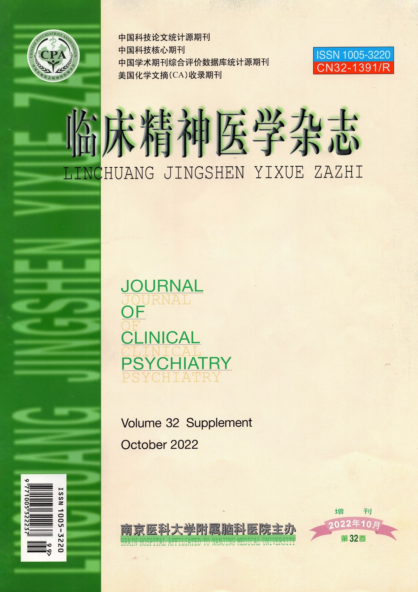
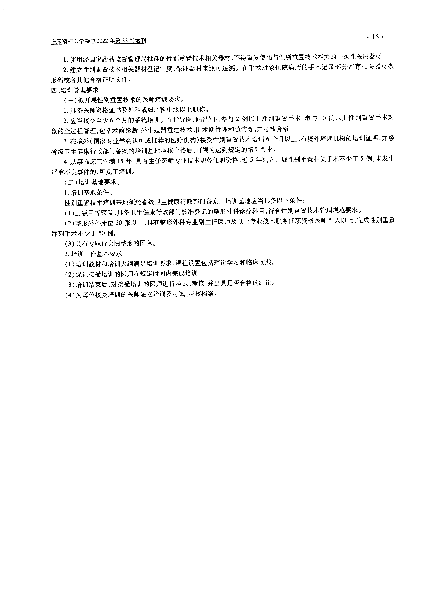
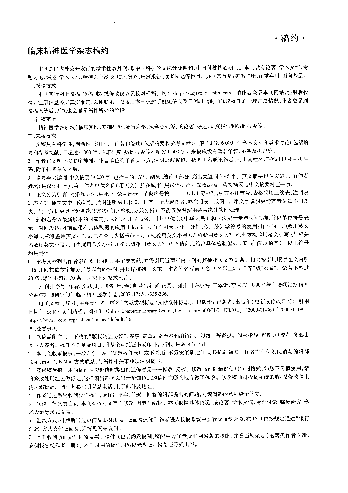

# 临床精神医学杂志

## Cover

## Table Of Contents

## Page 1

## Page 2

## Page 3

## Page 4

## Page 5

## Page 6

## Page 7

## Page 8

## Page 9

## Page 10

## Page 11

## Page 12

## Page 13

## Page 14

## Page 15

## Contract

## Committe

